## 1. Menú Principal

Una vez iniciada la aplicación nos aparecerá el menú principal, en el que se verán dos botones: uno que al clickarlo nos llevará a nuestra cuenta de gastos particular (**Cuenta Principal**) y el otro nos llevará al menú de gestión de nuestras cuentas compartidas (**Cuentas Compartidas**).

  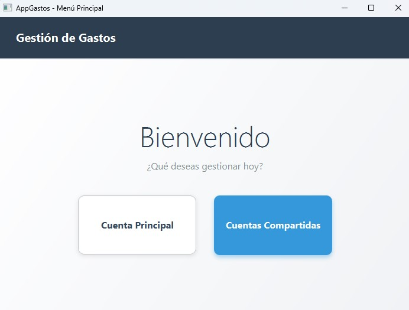

---

## 2. Cuenta Principal

Al entrar al menú de gestión de la cuenta principal se puede observar un listado con los últimos gastos particulares registrados por el cliente.

  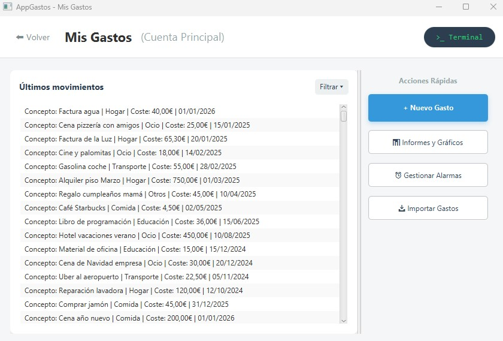

Además, contará con una herramienta de filtrado mediante la cual podrá filtrar dichos gastos por categoría, por meses, por un rango de tiempo (donde se le desplegarán dos calendarios para seleccionar las fechas) e incluso combinar estos filtros mencionados.

  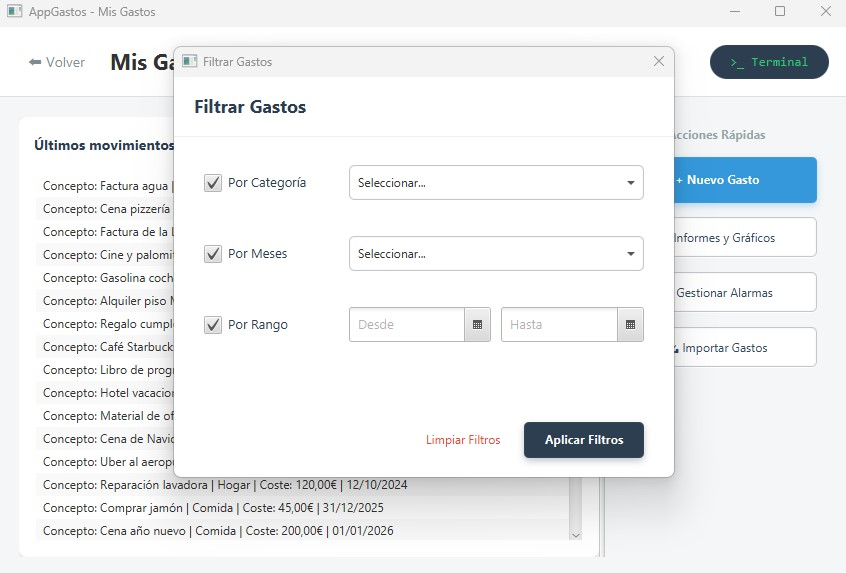

Por otro lado, a la derecha cuenta con diversas opciones para la gestión de los gastos.

### Nuevo Gasto
En primer lugar, cuenta con el botón de **Nuevo Gasto**, que permite crear un gasto nuevo rellenando su información necesaria.

  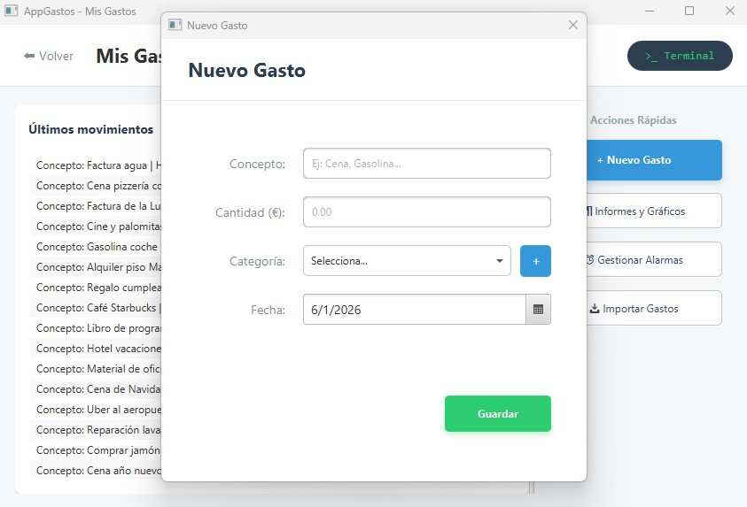

### Visualización de Gastos
También cuenta con una opción para consultarlos de forma más visual, concretamente en forma de listado, de gráfico de barras o de gráfico circular junto con la ordenación de los gastos por meses o por categorías.

Para que se muestre la visualización el usuario ha de marcar 2 opciones obligatoriamente: una del tipo de visualización y una del modo de clasificado.

  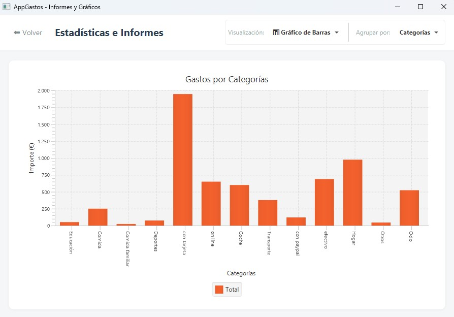
  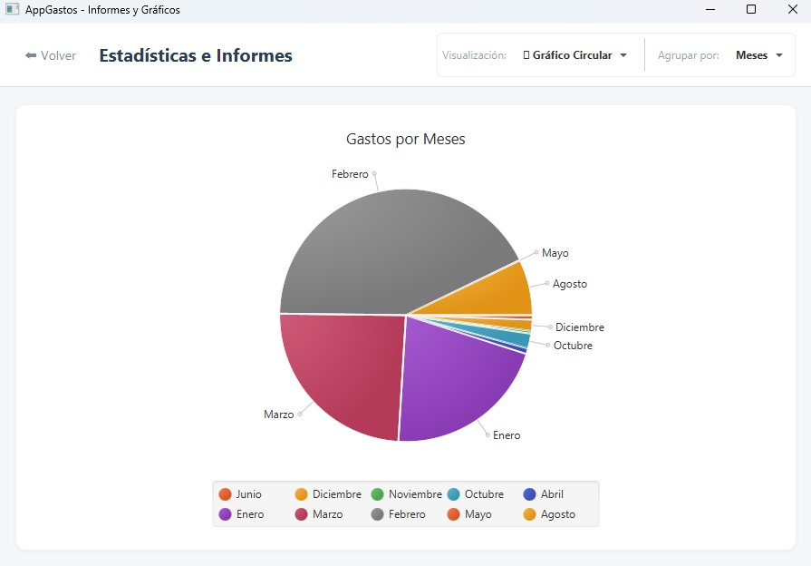

  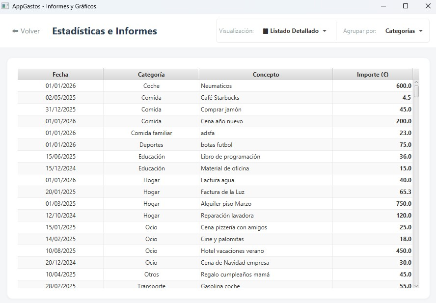

### Alarmas
Asimismo, en el mismo panel lateral de la cuenta principal, se tiene acceso a un sistema de gestión de alarmas relacionado con los gastos del usuario.

Si se clicka al botón **Alarmas**, aparece un listado con las alarmas creadas, las cuales harán saltar una notificación (en forma de Pop-up) una vez se supere el límite de gasto configurado por el usuario.

  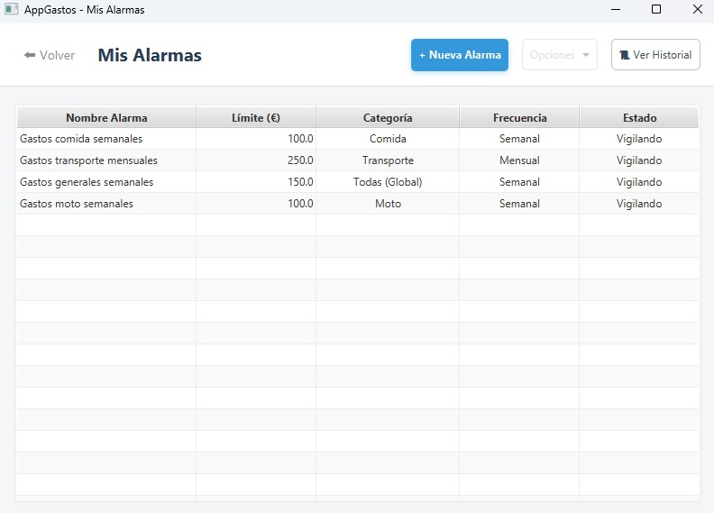
  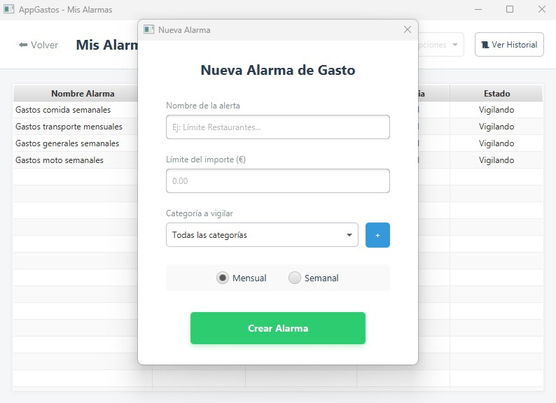

Además, a través de **Opciones Alarma**, se pueden editar las alarmas o incluso borrarlas. Incluso se cuenta con la posibilidad de ver el historial de notificaciones, con todas las que han saltado con el paso del tiempo.

  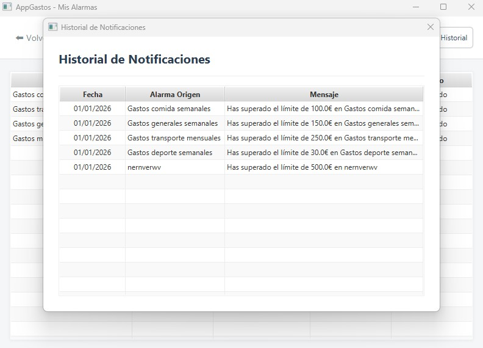

### Importador y Terminal
Volviendo al menú de la cuenta principal, el último botón del panel lateral (**Importador**) ofrece la posibilidad al usuario de importar gastos a través de un fichero `.csv`.

Y, por último, se cuenta con la posibilidad de añadir, eliminar y editar gastos a través de un **terminal**, donde el usuario deberá ir rellenando los campos del gasto que se le vayan pidiendo para poder crear el gasto o identificarlo en el caso de editar/eliminar.

  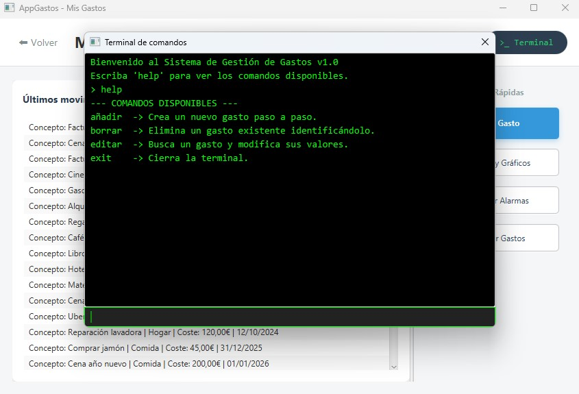

---

## 3. Cuentas Compartidas

Si en el menú inicial el usuario selecciona **Cuentas Compartidas**, se abrirá el menú para gestionar sus cuentas compartidas.

A la izquierda, aparecerán los nombres de dichas cuentas y, si se selecciona una, aparecerá en **Detalles** el nombre de los participantes junto con su información: porcentaje asociado con respecto a los gastos y su saldo (en verde, positivo (le deben) y en rojo, negativo (debe)).

Además, si se hace click derecho sobre la cuenta seleccionada, se ofrece la opción de poder borrarla.

  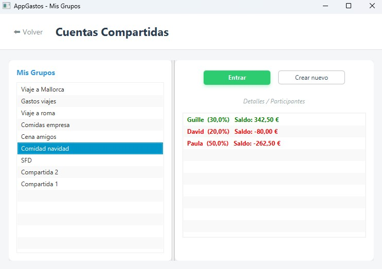

En la parte superior del recuadro de Detalles, contamos con dos botones: uno para crear una nueva cuenta compartida y otro para entrar a la cuenta seleccionada y poder gestionarla.

Respecto al primero mencionado, se desplegará una ventana donde poder rellenar todos los campos necesarios de la cuenta: nombre, integrantes y porcentajes asociados.

  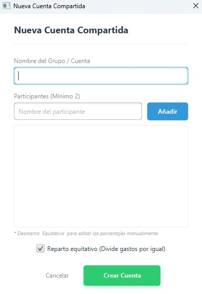

Y si se clicka para entrar a una cuenta, se abrirá un menú de gestión de cuenta compartida muy similar al previamente descrito sobre la cuenta principal del usuario.

Las únicas diferencias son que a la izquierda aparecen los datos de los integrantes (los que se podían previsualizar en el cuadro de Detalles) y que en el modo terminal, al crear un gasto, se debe especificar quién es el pagador.

Aquí para editar/borrar un gasto de forma manual, basta con hacer click derecho sobre él.

  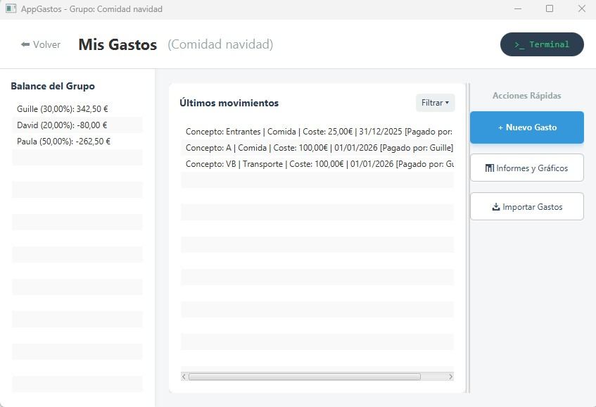

