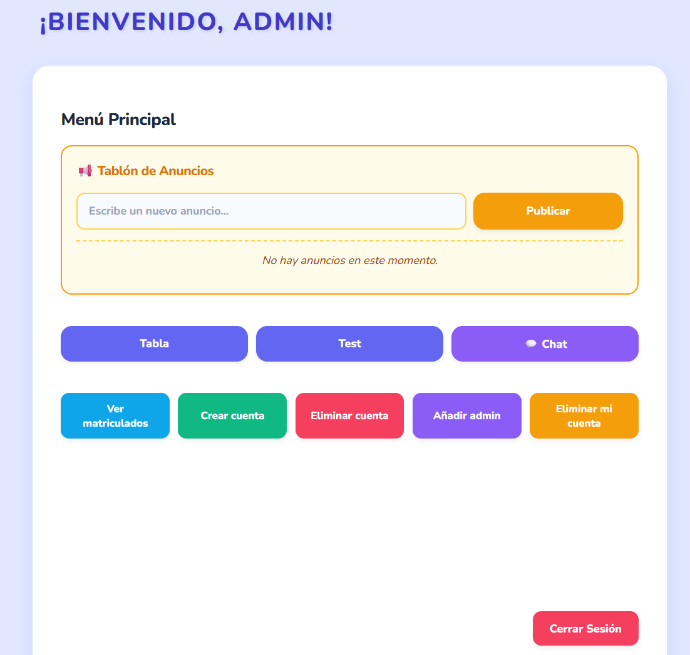

## AppVideoClases

Este proyecto implementa un sistemas para la administración y seguimiento de clases online. Presenta una interfaz con varias funcionalidades para el administrador y un menu sencillo para el alumno.

---

### Características principales

* JavaScript
* HTML
* CSS

---

## Imágenes de la aplicación

# Documentación de Vistas: App de Video Clases

A continuación se detallan las distintas pantallas de la aplicación, estructuradas según el tipo de usuario.

## Vistas del Administrador

- [Enlaces a Clases](imagenes/EnlacesClases.png): Sección para organizar, publicar y modificar los enlaces de las sesiones de video en directo.
- [Enlaces a Tests](imagenes/EnlacesTests.png): Apartado para la administración y distribución de cuestionarios y pruebas de evaluación.
- [Chat de Plataforma](imagenes/Chat.png): Interfaz de mensajería centralizada para la comunicación directa y resolución de dudas en la academia.
- [Lista de Matriculados](imagenes/ListaMatriculados.png): Listado completo y detallado de todos los estudiantes que tienen acceso activo a la plataforma.
- [Crear Usuario](imagenes/CrearUsuario.png): Formulario de registro manual para dar de alta a nuevos alumnos en el sistema.
- [Eliminar Usuario](imagenes/EliminarUsuario.png): Herramienta para gestionar las bajas y remover perfiles de estudiantes de la base de datos.
- [Eliminar Cuenta de Administrador](imagenes/EliminarCuentaAdministrador.png): Función de seguridad y control de accesos para retirar permisos a cuentas de gestión.
- [Tablón de Anuncios](imagenes/TablonDeAnuncios.png): Espacio dedicado a la publicación de noticias, actualizaciones y comunicados generales.
- [Añadir Administrador](imagenes/AñadirAdministrador.png): Formulario de alta para otorgar permisos de gestión y crear nuevos perfiles administrativos.

## Vistas del Alumno

- [Menú Alumno](imagenes/MenuAlumno.png): Vista principal y punto de acceso del estudiante a sus contenidos, clases, evaluaciones y avisos.

## Licencia

Este proyecto está bajo la licencia MIT. Consulta el fichero `LICENSE` para más información.

---

**¡Gracias por tu interés en este proyecto!**